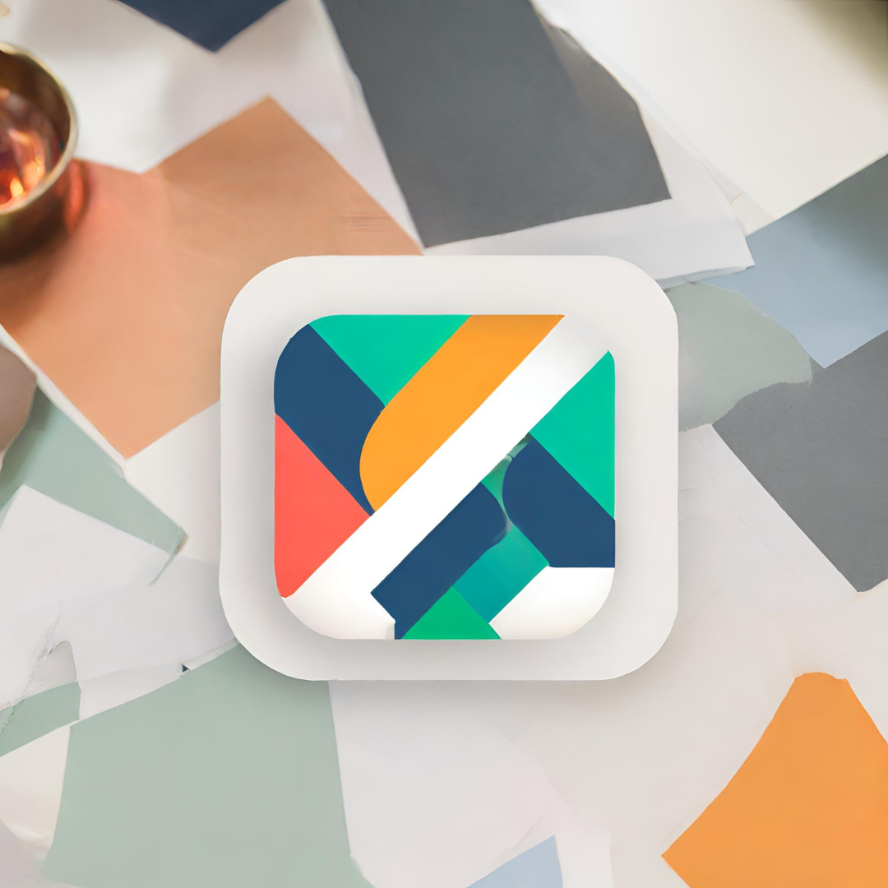

# Association manager

<br />
<div align="center">
  <a href="https://github.com/Tomocza/codecool-stackoverflow">
    
  </a>
</div>
<h3 align="center">Stack overflow-copy</h3>
<p align="left"></p>

## About The Project

Group manager for small and medium-sized civil organizations. You can manage with it the members' data, membership types, fees and events.

<!-- TABLE OF CONTENTS -->
<details>
  <summary>Table of Contents</summary>
  <ol>
    <li>
      <a href="#about-the-project">About The Project</a>
      <ul>
        <li><a href="#built-with">Built With</a></li>
      </ul>
    </li>
    <li>
      <a href="#getting-started">Getting Started</a>
      <ul>
        <li><a href="#installation">Installation</a></li>
      </ul>
    </li>
    <li><a href="#features">Features</a></li>
    <li><a href="#author">Author</a></li>
  </ol>
</details>


<!-- ABOUT THE PROJECT -->


## Built with

### Frontend (Under construction):

![React] <br/> ![MaterialUI] <br/> ![TypeScript] <br/>

### Backend: <br/>

![Java] <br/> ![SpringBoot]<br/> ![psql]

<p align="right">(<a href="#about-the-project">back to top</a>)</p>

<!-- GETTING STARTED -->
## Getting Started

## Prerequisites

1. JAVA
2. MAVEN
3. INTELLIJ
4. POSTGRESQL
5. NODE

## Installation

1. Clone the repo
   ```shell
   git clone git@github.com:PinterOliver/association.git
   ```
2. Install Java version 17 or higher


3. Install Apache Maven or IDE with built-in Maven support


4. Install an integrated development environment(IDE) - IntelliJ IDEA


5. Install PostgreSQL


6. Create a database in PostgreSQL


7. Create a .env file in the root folder with the following properties:

   ✅ DB_NAME=your database name

   ✅ DB_USER_NAME=your username

   ✅ DB_PW=your password

   ✅ DB_HOST=(probably localhost)

   ✅ DB_PORT=your db port

   ✅ JWT_SECRET=your secret key

   ✅ JWT_EXPIRATION=the expiration in ms for a login session to end


8. Run the application by the "Run" button in the top right corner or with Shift + F10 shortcut


9. Navigate to the frontend folder in terminal
     ```shell
     cd .\frontend
     ```

10. Install the frontend packages
     ```shell
     npm install
     ```

11. Start the application
     ```shell
     npm start
     ```

<p align="right">(<a href="#about-the-project">back to top</a>)</p>


<!-- Features -->

## Features:

1. Under construction

<!-- AUTHORS -->

## Author

### Pintér Olivér:

[![Github Pages]](https://github.com/PinterOliver)
[![Gmail]](mailto:pinter.oliver.peter@gmail.com)
[![LinkedIn]](https://www.linkedin.com/in/pinteroliverpeter/)


<p align="right">(<a href="#about-the-project">back to top</a>)</p>


<!-- MARKDOWN LINKS & IMAGES -->
<!-- https://www.markdownguide.org/basic-syntax/#reference-style-links -->

[MaterialUI]: https://img.shields.io/badge/Material%20UI-000000?style=for-the-badge&logo=mui&logoColor=white

[TypeScript]: https://shields.io/badge/TypeScript-000000?logo=TypeScript&logoColor=FFF&style=flat-square

[React]: https://img.shields.io/badge/React-000000?style=for-the-badge&logo=React

[Java]: https://img.shields.io/badge/Java-000000?style=for-the-badge&logo=openjdk

[SpringBoot]: https://img.shields.io/badge/SpringBoot-000000?style=for-the-badge&logo=SpringBoot

[psql]: https://img.shields.io/badge/postgresql-000000?style=for-the-badge&logo=postgresql

[Github Pages]: https://img.shields.io/badge/github-121013?style=for-the-badge&logo=github&logoColor=white

[Gmail]: https://img.shields.io/badge/Gmail-D14836?style=for-the-badge&logo=gmail&logoColor=white

[LinkedIn]: https://img.shields.io/badge/LinkedIn-0077B5?style=for-the-badge&logo=linkedin&logoColor=white
